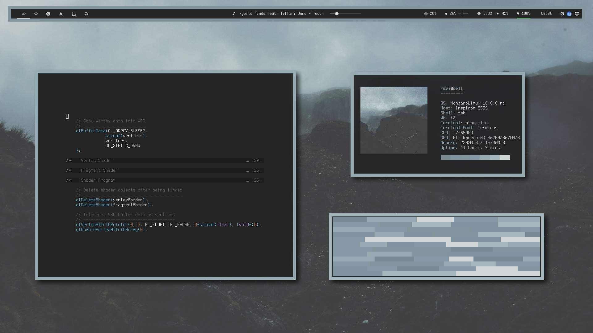
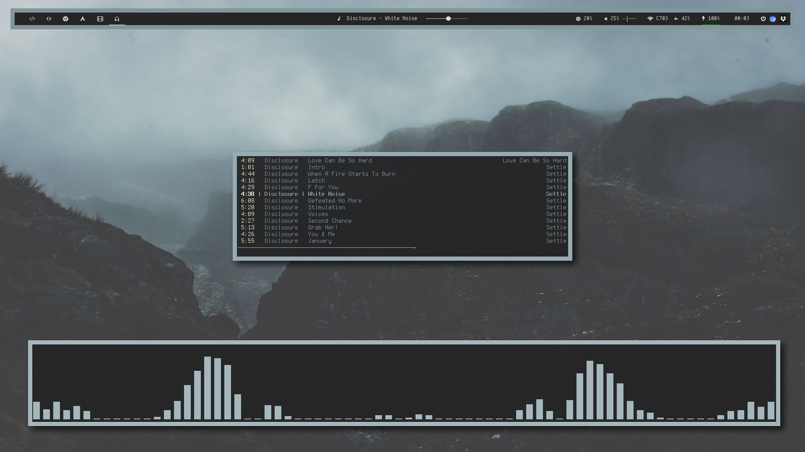

<h1 align="center">dotfiles ~ ✦</h1>

<table>
	<tbody>
		<tr>
			<td>
				
			</td>
            <td>
                
            </td>
        </tr>
    </tbody>
</table>

> A work in progress.  
> It's nice to have rices to work on, they make for excellent artisanal satisfaction. ❤

#### Applications

<table>
	<tbody>
		<tr>
			<td>
				<p>Shell</p>
			</td>
            <td>
                <p>zsh + oh-my-zsh</p>
            </td>
        </tr>
    </tbody>
</table>
| Shell | zsh + [oh-my-zsh](https://github.com/robbyrussell/oh-my-zsh) |
| Editor | vim + [pathogen](https://github.com/tpope/vim-pathogen) |
| Music | mpd + [ncmpcpp](https://github.com/arybczak/ncmpcpp) |


#### Directory Structure

```\.
├── bash_profile  
├── bashrc  
├── config  
│   ├── dunst  
│   ├── i3  
│   ├── mpd  
│   ├── mpv  
│   └── polybar  
│       ├── bars  
│       ├── config  
├── ncmpcpp  
├── vimrc  
└── zshrc  
```
